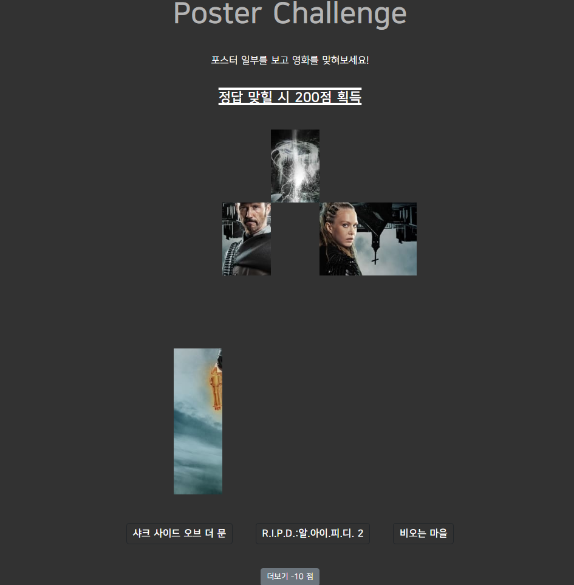

# 🔎 Moonan : 영화 추천 & 해결 커뮤니티 사이트

---

> Moonan은 기본적으로 영화 추천 서비스를 제공하며 사용자 간 영화 관련 질문을 주고 받는 탐정 테마 영화 커뮤니티 사이트입니다.

> 이 영화 뭐지? 할 때 정보를 공유하며 궁금함을 해결할 수 있는 서비스

### Information

---

- 백엔드 & 조장 : 정준우
- 프론트엔드 : 이정훈
- 2023.05.16 ~ 2023.05.25 ( 10 days )

| 팀원   | 업무 내용                                                                                          |
| ------ | -------------------------------------------------------------------------------------------------- |
| 정준우 | 백엔드 - Django 모델 구성, fixture 제작, RESTful API 구성, CSS , 발표 자료                         |
| 이정훈 | 프론트 엔드 - 프로토타입 제작, Vue 컴포넌트 관리 및 Vue Axios(로그인, front-back 연결), CSS , 발표 |

- Tool
  - Git - 프로젝트 소스코드 관리
  - Notion - 기획 회의 내용 기록 및 일일 작업 확인 체크 용도
  - Mattermost - 파일 전송 및 실시간 소통 용도
  - Figma - Prototype 제작
  - Sqlite3 - DataBase

### Installation

---

개발환경

- Django
  - v3.2.18
- Vue
  - Vue 2.6.14

Server setting

- django server

  ```bash
  cd backend
  pip install -r requirements.txt
  py manage.py makemigrations
  py manage.py migrate
  py manage.py loaddata movie_data.json actor_data.json genre_data.json recommend_data.json
  py manage.py runserver
  ```

- vue server

  ```bash
  cd frontend
  npm i
  npm run serve
  ```

### Description

---

- **Home.** 메인 페이지로 \*\*\*\*인기 영화의 포스터를 추천

- **Movie.** 인기순, 평점 순, 카테고리 별 영화 검색

- **Clue**. 영화 포스터 맞추기

- **Recommend.** 각 테마에 맞는 영화 리스트를 추천

- **Mongtage**. 영화 관련 질문 게시판

- **Search**. 영화 검색 기능

- **Profile**. 유저가 체크한 시청한 영화와 보고 싶은 영화 목록을 확인 가능하며 유저간 Follow 가능

- **Movie Detail**. 영화에 대한 상세 정보 확인, 한 줄평 작성

- 상세 명세서

  1. Home
     1. 인기 영화의 포스터를 Carousel을 이용해 보여주며, 자동으로 넘어가게 구현 - 누르면 상세 정보로
     2. 하단에 각 10개의 영화를 가진 추천 리스트들 중 일부를 무작위로 보여주며 또한 누르면 상세 정보로
  2. Movie
     1. 장르 카테고리를 선택해 고른 장르의 영화만 볼 수 있도록 구현
     2. 스크롤을 내리면 계속해서 영화 목록을 불러올 수 있도록 구현
     3. 다시 페이지 최상단으로 올라갈 수 있는 버튼 구현
     4. 각 영화의 포스터를 클릭하면 상세 정보로 갈 수 있도록 구현
  3. Clue
     1. DB내의 무작위 영화의 포스터의 일부를 보고 주어진 보기 중 알맞은 영화를 맞추는 게임 구현
     2. 포스터 조각을 하나씩 더 제공받을 때마다 맞췄을 시 얻을 점수 감소
     3. 정답을 맞추면 현재 로그인된 유저의 프로필 정보 중 Points 를 증가
  4. Recommend
     1. Home 처럼 추천 리스트 중 일부를 가져와 정보 제공
     2. 포스터를 클릭하면 해당 영화의 상세정보로 이동
  5. Community
     1. 알고 싶은 영화에 대해 이미지와 함께 내용을 올릴 수 있도록 구현
     2. 질문 글을 올릴 때 본인이 보유한 포인트 내에서 상금을 걸 수 있도록 구현
     3. 답변이 채택된다면 질문자가 걸어 놓은 포인트를 답변자가 가져가도록 구현
     4. 채택된 답변에 테두리를 만들어줘 어떤 답변이 정답인지 한 눈에 볼 수 있도록 구현
     5. 해결된 질문과 아닌 질문을 쉽게 구별할 수 있는 요소 추가
  6. Search
     1. 띄어쓰기를 통해 구분된 여러 요소를 한 번에 고려한 검색을 구현
  7. Login / Signup
     1. 따로 페이지를 만들지 않고 한 페이지에서 로그인과 회원가입 중 하나를 할 수 있도록 구현
  8. Profile
     1. 프로필 사진 기능 구현
     2. 보고 싶은 영화, 이미 본 영화 리스트 구현
     3. 팔로우 기능 구현
  9. Detail
     1. 각 영화의 상세 정보 제공
     2. 보고 싶은 영화, 이미 본 영화 리스트에 추가할 수 있는 기능 구현
     3. 예고편 제공
     4. 배우 목록 제공
     5. 영화에 대한 한 줄평과 별점 부여 기능 구현

> **ERD**

---


---

> **Commponent-Diagram**

---


---

## Backend - Django

---

1. Home / Recommend

   메인 페이지나 추천 페이지에서 영화 리스트를 가져올 때 개별 영화 정보 내의 인기 / 평점을 이용해 두 가지 방식으로 정렬될 수 있도록 구현해야 했다.

   views는 python 파일로 만들어진다는 근거 하나로 받아온 Queryset을 리스트 형태로 바꾸고,

   popularity 나 vote_avg를 기준으로 정렬해 원하는 기능을 구현할 수 있었다.

   Django 과정 중 배운 것 뿐만 아니라 python의 기초적인 지식도 결합해 문제를 해결할 수 있다는 것을

   학습한 과정이었다.

2. Movie

   영화 정보, 장르, 배우, 추천 리스트 등 다양한 정보가 필요해서 적절한 Json 파일을 만들 필요가 있었다.

   ```python
   def get_movie_datas():
       total_data = []

       for i in range(1, 10):
           request_url = f"https://api.themoviedb.org/3/movie/popular?api_key={TMDB_API_KEY}&include_adult=false&language=ko-KR&page={i}"
           movies = requests.get(request_url).json()

           for movie in movies['results']:
               if movie.get('release_date', ''):
                   fields = {
                       # 'movie_id': movie['id'],
                       'title': movie['title'],
                       'released_date': movie['release_date'],
                       'popularity': movie['popularity'],
                       'vote_avg': movie['vote_average'],
                       'overview': movie['overview'],
                       'poster_path': movie['poster_path'],
                       'genres': movie['genre_ids'],
                   }

                   data = {
                       "pk": movie['id'],
                       "model": "movies.movie",
                       "fields": fields
                   }

                   total_data.append(data)

       with open("movies/fixtures/movie_data.json", "w", encoding="utf-8") as w:
           json.dump(total_data, w, indent=4, ensure_ascii=False)
   ```

   위 코드는 영화 데이터 중 지정한 필드의 요소만을 가져와 Json 파일로 만들어주는 것으로,

   위 코드를 기반으로 정보를 수정해 필요한 자료들을 모두 얻어낼 수 있었다.

   그 중 배우 데이터는 따로 제공되지 않아 특정 영화의 크레딧을 추출 할 수 있는 TMDB API를 통해

   갖고 있는 영화들의 모든 크레딧 중, 역할이 ‘Acting’인 사람들을 따로 추출해 DB에 있는 영화들에 한정해

   모든 배우들의 목록을 얻어낼 수 있었다.

   복잡하고 코드 실행 시간도 오래 걸리는 과정이긴 했지만, 데이터 간의 연관성을 파악하고 필요한 정보를

   얻어낼 수 있는 역량을 기를 수 있는 과정이었다 생각한다.

3. Clue

   ```python
   @api_view(['PUT'])
   @permission_classes([IsAuthenticated])
   def choose_answer(request, points_get):
       me = get_object_or_404(Profile, user = request.user)
       serializer = ProfileSerializer(me, data = request.data)
       if serializer.is_valid(raise_exception = True):
           serializer.save(points = me.points + points_get)
           return Response(status = status.HTTP_200_OK)
   ```

   정답을 맞추면 현재 로그인된 계정의 포인트를 증가시켜주는 함수다.

   ```python
   class Profile(models.Model):
       user = models.ForeignKey(settings.AUTH_USER_MODEL, on_delete = models.CASCADE)
       points = models.IntegerField(default = 500)
       want_to_see_movies = models.ManyToManyField('movies.Movie', related_name = 'wants_users')
       watched_movies = models.ManyToManyField('movies.Movie', related_name = 'watches_users')
       profile_image = models.ImageField(null = True)
   ```

   포인트 필드가 들어있는 프로필 모델이다.

   가입하자마자 기본 포인트를 제공해주고 싶어 프로필 생성 후 포인트를 추가해주는 방법을 생각했지만,

   할 수는 있을 것 같아도 복잡해 구현이 쉽지 않았다.

   모델을 지정해줄 때 default를 통해 초기값을 정해줄 수 있다는 것을 알게 되었고, 이를 활용해

   기본 포인트 제공을 너무 간단하게 구현할 수 있었다.

   이외의 부분들은 Django 학습 과정 중 배운 것을 통해서 무난하게 구현할 수 있었지만,

   이는 Profile 모델에서 직접 넣어줘야 하는 부분이 포인트 뿐이라 그랬던 것임을 이후 과정에서 알게 되었다.

4. Community

   ```python
   @api_view(['GET', 'POST'])
   @permission_classes([IsAuthenticated])
   def create_question(request):
       serializer = QuestionSerializer(data = request.data)

       me = get_object_or_404(Profile, user = request.user)

       if me.points < int(serializer.initial_data['points']):
           return Response(status = status.HTTP_400_BAD_REQUEST)

       serializer2 = ProfileSerializer(me, data=request.data)

       if serializer.is_valid(raise_exception = True):
           serializer.save(user = request.user)

           if serializer2.is_valid(raise_exception = True):
               serializer2.save(points = me.points - serializer.data['points'])

               return Response(serializer.data, status = status.HTTP_201_CREATED)
   ```

   질문글에서 구현해야 할 첫 기능은 질문을 생성할 때 사용자가 입력한 숫자만큼 포인트를 차감하는 것이었다.

   처음에는 serializer2 부분만 있었는데, 아무 숫자나 입력해보다가 사용자가 보유한 포인트보다 더 큰 포인트를

   상금으로 걸 수 있다는 것을 알게 되었다.

   하지만 기존에 알던 방식으로는 serializer의 유효성 검사가 수행되기 전에 포인트를 가져와 입력값과 비교할 수가 없었다.

   serializer.initial_data[’field’] 를 통해 유효성 검사가 이루어지기 전에 field값을 가져와 사용할 수 있었고,

   이를 통해 글이 작성되기 전 적절한 포인트를 갖고 있는지 확인할 수 있게 되었다.

   ```python
   @api_view(['PUT'])
   @permission_classes([IsAuthenticated])
   def select_comment(request, question_pk, comment_pk):
       question = get_object_or_404(Question, pk = question_pk)
       if question.is_completed == False:
           if request.user == question.user:
               comment = get_object_or_404(QuestionComment, pk = comment_pk)
               answerer = get_object_or_404(Profile, user = comment.user)
               serializer = ProfileSerializer(answerer, data = request.data)
               if serializer.is_valid(raise_exception = True):
                   serializer.save(points = answerer.points + question.points)

                   serializer2 = QuestionSerializer(question, data = request.data, partial = True)
                   if serializer2.is_valid(raise_exception = True):
                       serializer2.save(is_completed = True)

                       serializer3 = QuestionCommentSerializer(comment, data = request.data, partial = True)
                       if serializer3.is_valid(raise_exception = True):
                           serializer3.save(is_chosen = True)
                   return Response(status = status.HTTP_200_OK)
       return Response(status = status.HTTP_401_UNAUTHORIZED)
   ```

   질문이 채택되었을 때 포인트를 제공하고 질문을 해결 상태로 바꾸며, 채택된 답변을 특정할 수 있도록 구현해야 했다.

   Clue 페이지에서 바뀐 포인트의 값만 주면 문제 없이 구현되었던 것과는 달리, 이번 단계에서는

   is_completed나 is_chosen 값만 바꾸려고 하니 나머지 값들도 제공해야만 한다고 해 함수가 실행되지 않았다.

   serializer 지정 과정에서 partial = True 조건을 부여해주면 serializer의 일부분만 변경할 수 있다는 것을 알게 되었고, 이를 통해 필요한 기능들을 모두 구현할 수 있었다.

5. Search

   ```python
   @api_view(['GET'])
   def movie_search(request, search):
       for word in search.split():
           movies = Movie.objects.filter(Q(title__icontains = word) | Q(overview__icontains = word) | Q(genres__name__icontains = word))
           searched_movies = []
           for movie in list(movies):
                   if movie not in searched_movies:
                       searched_movies.append(movie)
       searched_movies.sort(key = lambda x : x.popularity, reverse = True)
       serializer = MovieListSerializer(searched_movies, many = True)
       return Response(serializer.data)
   ```

   검색 단어를 띄어쓰기를 기준으로 나누고, 나눈 요소 하나하나를

   filter-Q와 icontains를 통해 제목 / 줄거리 / 장르 중 하나라도 포함되어 있다면

   해당 영화가 결과로 출력될 수 있도록 했다.

   Q는 Django model ORM 으로 where절에 or, and, not 조건을 부여해주고 싶을 때 사용된다.

   icontains는 같이 입력해준 문자열을 포함한 요소를 찾아주는 명령어로,

   대소분자를 구분하는 contains와 달리 대소문자를 구분하지 않아 더 다양한 검색 결과를 얻을 수 있다.

6. Profile

   ```python
   @api_view(['GET', 'PUT'])
   def profile(request, username) :
       user = get_object_or_404(get_user_model(), username = username)
       profile = get_object_or_404(Profile, pk = user.id)
       if request.method == 'GET' :
           serializer = ProfileSerializer(profile)
           return Response(serializer.data)

       elif request.method == 'PUT':
           if request.user == profile.user:
               serializer = ProfileSerializer(profile, data=request.data)
               if serializer.is_valid(raise_exception = True):
                   serializer.save()
                   return Response(serializer.data)
           return Response(status = status.HTTP_401_UNAUTHORIZED)
   ```

   프로필과 유저를 연결시켜주기 위해, 처음으로 오브젝트를 두개 이상 가져와 사용해봤다.

   username을 통해 특정 유저의 데이터를 가져오고 그것을 통해 해당 유저의 프로필과 연결해

   데이터를 가져오거나 수정할 수 있도록 구현했다.

7. Detail

   ```python
   @api_view(['POST'])
   @permission_classes([IsAuthenticated])
   def wanted(request, movie_pk):
       me = get_object_or_404(Profile, pk = request.user.pk)
       movie = get_object_or_404(Movie, pk = movie_pk)

       if me.want_to_see_movies.filter(pk = movie_pk).exists():
           me.want_to_see_movies.remove(movie)
           wanted = False
       else:
           me.want_to_see_movies.add(movie)
           wanted = True

           if me.watched_movies.filter(pk = movie_pk).exists():
               me.watched_movies.remove(movie)
               is_watched = False

       serializer = ProfileSerializer(me)
       return Response(serializer.data)

   @api_view(['POST'])
   @permission_classes([IsAuthenticated])
   def watched(request, movie_pk):
       me = get_object_or_404(Profile, pk = request.user.pk)
       movie = get_object_or_404(Movie, pk = movie_pk)

       if me.watched_movies.filter(pk = movie_pk).exists():
           me.watched_movies.remove(movie)
           watched = False

       else:
           me.watched_movies.add(movie)
           watched = True

           if me.want_to_see_movies.filter(pk = movie_pk).exists():
               me.want_to_see_movies.remove(movie)
               wanted = False

       serializer = ProfileSerializer(me)
       return Response(serializer.data)
   ```

   위의 프로필에서 구현했던 것과 마찬가지로, 두 개의 오브젝트를 가져와 사용했다.

   요청한 사용자의 데이터에서 pk를 가져오고, 현재 보고 있는 영화 상세 페이지의 정보를 이용해 영화 id를 가져와

   이미 리스트에 있다면 삭제하고 아니라면 추가하는 식으로 wanted와 watched 모두 구현했다.

   두 가지가 같이 체크 되어 있을 수 없기 때문에 한 쪽 함수가 실행되었을 때 다른 쪽도 살펴보며

   동시에 활성화되지 않게 조치했다.

   ```python
   class ReviewCommentSerializer(serializers.ModelSerializer):
       child_comments = serializers.PrimaryKeyRelatedField(many = True, read_only = True, allow_null = True)

       class Meta:
           model = ReviewComment
           fields = ('id', 'review', 'content', 'user', 'created_at', 'updated_at', 'parent_comment', 'child_comments')
           read_only_fields = ('user', 'review', 'parent_comment')
   ```

   대댓글 기능 구현을 위해 자식 댓글의 정보를 얻을 수 있도록 serializer를 구성했다.

   ```python
   @api_view(['POST'])
   @permission_classes([IsAuthenticated])
   def create_review_comment(request, review_pk):
       review = get_object_or_404(Review, pk = review_pk)
       serializer = ReviewCommentSerializer(data = request.data)

       if serializer.is_valid(raise_exception = True):
           serializer.save(user = request.user, review = review)
           return Response(serializer.data, status = status.HTTP_201_CREATED)

   # 대댓글
   @api_view(['POST'])
   @permission_classes([IsAuthenticated])
   def review_ccomment_create(request, comment_pk):
       comment = get_object_or_404(ReviewComment, pk = comment_pk)
       serializer = ReviewCommentSerializer(data = request.data)

       if serializer.is_valid(raise_exception = True):
           serializer.save(user = request.user, parent_comment = comment)
           return Response(serializer.data, status = status.HTTP_201_CREATED)
   ```

   댓글과 대댓글의 함수는 따로 구분했고, 댓글을 추가하는 과정은 같지만 해당 댓글이 추가되는 곳이

   리뷰인지, 다른 댓글인지에 따라 오브젝트를 다르게 가져와 구현했다.

   ***

## Frontend - Vue

---

1. packages

   - axios
   - vue-router
   - vuex
   - vuex-persistedstate

2. Prototype

   - 디자인 툴 Figma를 이용하여 제작 https://www.figma.com/proto/fwA4fj5b36KaCumLDnD9YV/Film?type=design&node-id=5-2&scaling=min-zoom&page-id=0%3A1 링크
   - Figma를 처음 써봤는데 생각보다 틀만 구성하는데도 시간이 오래 걸렸다.
   - 그래도 한번 틀을 구성하니 이후에 컴포넌트와 뷰 구성이 편해졌다.

3. Reference

   - 인터넷에는 상상이상으로 많은 reference가 있어서 원하는 코드를 복사해 적당히 바꿔서 쓸 수 있는 점이 좋았습니다. 다만, 많은 복붙개발은 실력 향상에는 도움이 되지 않기 때문에 경계해야겠습니다.
   - carousel 컴포넌트, 별점 기능, 로그인폼, 깔끔한 체크박스 등을 인터넷에서 참고했습니다.

4. Clue : 영화 포스터 맞추기

   - 영화 포스터를 25등분하여 한 조각씩 보여주어 세 개의 선택지 중에서 영화 제목을 고르는 기능을 직접 만들었습니다.

   - background-image와 background-position, top, left 속성을 적절히 활용해 구현했습니다.

     ```css
     <div v-for="(hint, idx) in showHintList" :key="idx" class="quiz_hint"
       :style="`top: ${(img_size_y) * hint.offset_y}px; left: ${(img_size_x) * hint.offset_x}px;
       background-position : ${hint.offset_x * 100}% ${hint.offset_y * 100}%;
       background-image: url('${imageURL(randomMovie[0])}');`"></div>
     ```

   - 포스터마다 height 가 조금씩 달라 완벽하지는 않지만 css와 javascript로 퀴즈 기능을 만드니 재밌는 경험이었습니다.

     

5. 무분별한 Component 생성

   - 한번 쓰는 요소임에도 컴포넌트로 만들어 기능에 비해 많은 컴포넌트가 만들어졌습니다. 물론 기능별 코드의 길이가 짧아서 한눈에 보기는 편했습니다만 이 파일 저 파일 옮겨 다녀야 하니 불편했습니다. 앞으로는 여러 곳에서 사용할 요소가 아니면 컴포넌트로 만들어 사용하는 것을 자제해야겠습니다.

### ScreenShot

---

### Logo

---

Moonan : 코난 + Movie


---

## 느낀점

---

### 정준우

> 진짜 최종 프로젝트

- 최종 프로젝트인만큼, 초반에 학습했던 내용에서부터 후반부 내용까지 모든 걸 사용해서야 하나의 서비스를 구현할 수 있었다. 완벽히 학습되지 않아 단편적인 기억들을 더듬어 대부분 검색 과정을 한 번은 거치고 나서야 코드로 적어나갈 수 있었다. 하지만 “여기에 쓸만한 이런 게 있었던 것 같은데?” 하는 생각이 들어서 이리저리 자료를 찾아보면 해당 내용이 금방 나와 코드에 적용할 수 있었고, 그 과정에서 더 나아가 더 효율적으로 같은 기능을 구현할 수 있는 방법을 찾는 경우도 자주 있었다.

> 일단 해보는 것

- 완벽히 이해하지 못한 지식이라도 우선 학습하고 경험해두면 다시 그 내용을 알아봐야 할 때 기반이 없는 것보다는 훨씬 효율적인 과정을 거칠 수 있다는 것을 확실히 깨달은 프로젝트였고, 현재 python 하나도 완벽히 다루지 못하는 상황에서 취업 시장의 분위기에 맞춰 Java를 공부해야 할지 말지 고민하던 상황에서 일단 python으로 프로그래밍 경험을 쌓았으니 두 언어를 모두 공부해나가며 “업무에서 써 보진 않았지만 쓸 줄은 압니다” 라도 말할 수 있도록 해야겠다는 결심을 할 수 있게 한 프로젝트였다.

### 이정훈

> 프로젝트 규모

- 싸피에서 가장 바쁘게 보낸 일주일이 아닌가 싶습니다. 프로젝트가 시작되니 생각보다 개발 속도가 빠르지 않았고 개발 진행 속도에 대한 감이 없다 보니 프로젝트 규모를 설정하는데 있어 어려움이 있었습니다. 스케일을 작게 잡아도 어느새 UI&UX 와 독창성을 생각하다 보니 어느새 프로젝트 규모가 커져 있었습니다. 다른 팀들의 프로젝트를 보며 승부욕에 더 그랬던 것 같습니다. 더 구현해보고 싶은 기능들이 있지만 이렇게 마무리 짓는 것이 아쉽습니다.

> 프로젝트 경험의 중요함

- 같이 팀을 이룬 정준우 님은 같은 알고리즘 스터디원이었기 때문에 친분이 있고 마음도 잘 맞아서 프로젝트가 순탄한 편이었지만, 서로 협업 경험이 적다 보니 상호 간에 소통이 적었습니다. 앞으로는 마음이 맞지 않는 팀원과도 협업 할 일은 많을 것이니 앞으로 있을 프로젝트에서 시행착오를 통해 의사소통 능력을 길러야겠습니다.

> 문제를 만나야 한다

- 개발 중에 사소한 에러에 시간을 잡아 먹히는 일이 많았습니다. 처음 보는 에러는 해결에 어려움이 있었고 겪었던 에러는 상대적으로 해결이 수월했습니다. 결국 에러는 경험 부족에서 나옴을 체감했습니다. 앞으로 있을 2학기 프로젝트에서 최대한 많은 문제를 경험해서 문제 해결능력을 기르고 싶습니다. 개발에 있어서 암기보다 경험이 중요한 것 같습니다.
